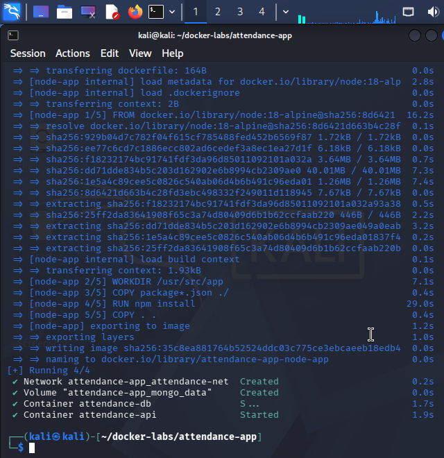
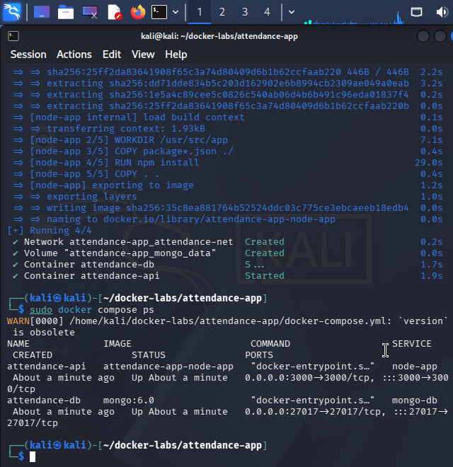
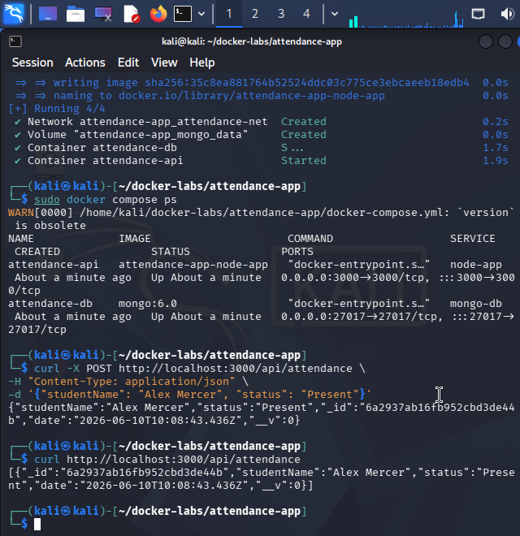

# Lab 1: Student Attendance App Deployment

## Project Purpose
A containerized web API designed to allow student attendance management utilizing a Node.js Express backend connected to an isolated MongoDB document store database.

## Architecture Diagram
Browser ---> Node.js API (Port 3000) ---> MongoDB Engine (Port 27017)
## How to Run the Infrastructure
1. Move to the directory context: `cd ~/docker-labs/attendance-app`
2. Run the Docker Compose configuration: `sudo docker compose up -d`

## Commands Used During Deployment
- `sudo docker compose up -d` - Launches multi-container microservices silently.
- `sudo docker compose ps` - Confirms resource operational health states.
- `curl` - Tests network endpoints directly inside the terminal.

## Execution Proof (Screenshots)

### 1. Stack Initialization

### 2. Container Health Matrix

### 3. API Transaction Proof

